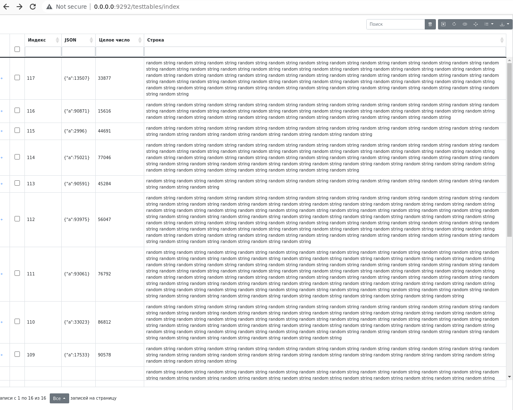

# wapp_framework

Фреймфорк для создания простых проектов на php.

## 1.1. Скриншоты

### 1.1.1. Пример работы с bootstrap-tables

## 1.2. Зависимости

- Основное
    - библиотека RedBeansPHP - ORM - https://github.com/gabordemooij/redbean
    - библиотека league/url - работа с url - https://github.com/thephpleague/url
    - библиотека ifsnop/mysqldump-php - mysqldump - https://github.com/ifsnop/mysqldump-php
- Дополнительное
    - bootstrap
    - bootstrap-tables

## 1.3. Стуктура проекта

- bin/cli - коммандная оболочка для проекта
- src/Modules - Основная папка с модулями (основной код здесь, приложение идет как модуль, дописывать сюда)
    - Core - Основной модуль проекта (является примером-шаблоном для других модулей)
        - Commands - классы комманд унаследованных от BaseCommand
        - Controllers - классы контролеров унаследованных BaseController, CRUDController
        - Generators - классы генераторов кода унаследованных от BaseGenerator
        - Helpers - классы-хелперы
        - Lib - библиотека классов, здесь же назодятся базовые классы
        - Models - классы моделей наследованных от BaseModel
        - Scheduler - 
        - Services - 
        - static - статика js, css
        - templates - шаблоны файлов для генераторов
        - views - шаблоны для HTML шаблонизатора базовый класс View
    - index.php - основной файл для подключения
    - Project.php - Файл описывающий проект, здесь располагаются списки подключаеммых контроллеров, модулей, альясов, комманд (будет заменен)
- src/lib
    - RedBeanPHP - библиотека для работы с БД (ORM) в одном файле
- tests
- vendor - нужен для composer autoload.php
- .env
- cli.sh - коммандная оболочка для проекта (включает .env)
- start_dev_server.sh - запускает dev-сервер (включает .env)
- index.php - точка входа

## 1.4. Параметры env

- DEBUG=1 - включаем отладку
- SERVER_PORT=9292 - порт dev сервера
- SERVER_HOST=0.0.0.0 - хост dev сервера
- DATABASE_PROTOCOL=sqlite
- DATABASE_DB=./data/dbfile.db
- DATABASE_HOST=
- DATABASE_PORT=
- DATABASE_SOCKET=
- DATABASE_CHARSET=
- DATABASE_USER=
- DATABASE_PASSWORD=

## 1.5. Что нужно прописывать в массивах

- При создании модуля
    - в src/Modules/[МОДУЛЬ]/Module.php
        - Добавить $sDefaultController
        - Добавить $sDefaultMethod
        - Добавить $aControllers
        - Добавить $aPreloadViews
    - в src/Modules/[МОДУЛЬ]/Aliases.php
        - Добавить альясы
    - в src/Modules/[МОДУЛЬ]/Commands.php
        - Добавить $aCommands
    - в src/Modules/[МОДУЛЬ]/View.php
        - Добавить TEMPLATES_PATH
        - Добавить $sDefaultLayoutTemplate
        - Добавить $sDefaultContentTemplate
    - в src/Modules.php
        - $aModules - добавить класс модуля
        - $aAliases - добавить яльясы модуля
        - $aCommands - добавить комманды модуля

## 1.6. Подключение к БД

Подключение происходит при первом использовании модели

## 1.7.  